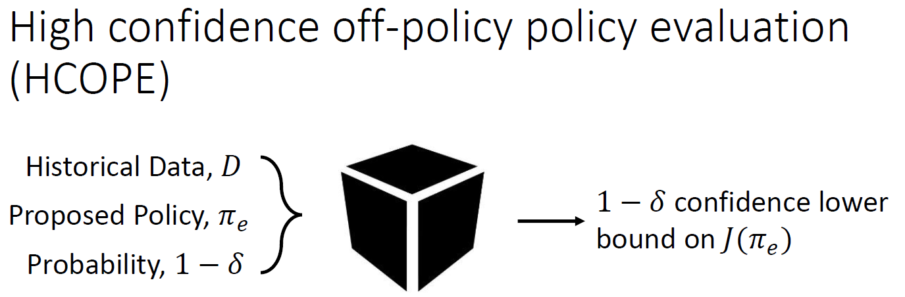
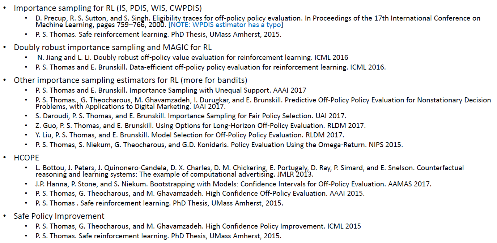
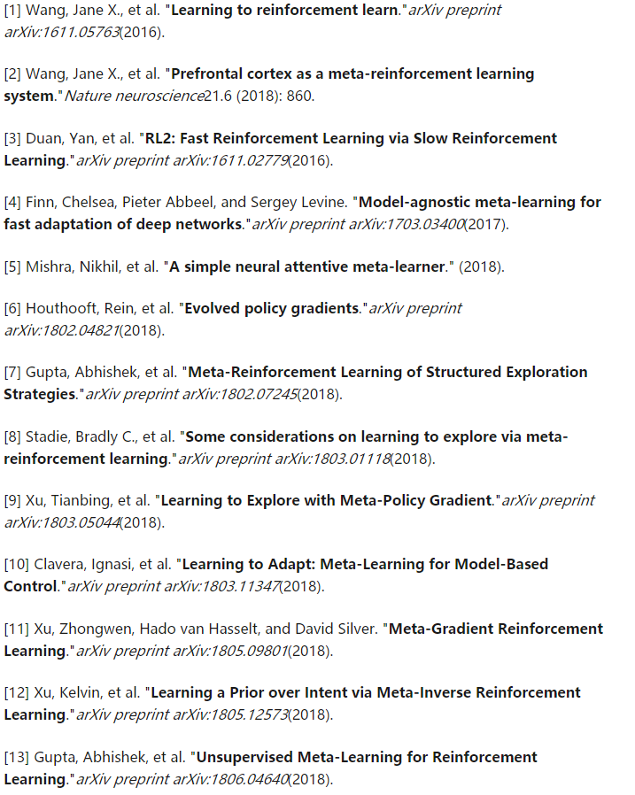
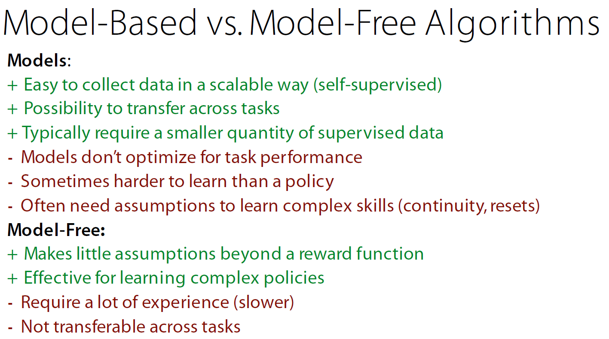
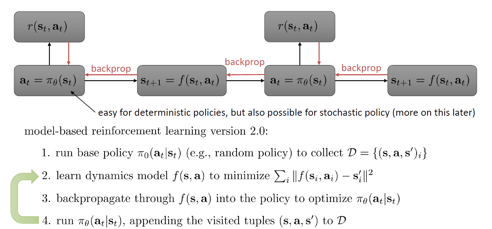

# Safe RL

### 研究者

Philip S. Thomas  [safe RL的talk视频](https://www.youtube.com/watch?v=saHMbn84V_s&t=5s)    

### Safe RL的一些概念

Safe RL的Safe是有不同的定义方法的。但是无论如何定义都是要保证其算法性能的提高。

“I guarantee that with probability at least $1-\delta$ , I will not change your policy to one that is worse than the current policy.”

#### 一些限制条件

- 假定初始policy是可以获得的
- 假定初始policy已知
- 假定初始policy是stochastic的

#### 分类

- Worst Case Criterion包括the parameter uncertainty

- Risk-Sensitive Criterion则是针对于Risk进行评判

  ​			

  ​			Penalize variance: $J(\pi)=\mathbf{E}\left[\sum_{t=1}^{L} \gamma^{t} R_{t} | \pi\right]-\lambda \operatorname{Var}\left(\sum_{t=1}^{L} \gamma^{t} R_{t} | \pi\right)$ 

- External Knowledge: (i) providing initial knowledge, (ii) deriving a policy from a nite set of demonstrations and, (iii) providing teach advice.

#### 例子

​	通过hoeffding不等式得到

​							$\begin{array}{c}{\mathrm{E}\left[X_{i}\right] \geq \frac{1}{n} \sum_{i=1}^{n} X_{i}-b \sqrt{\frac{\ln (1 / \delta)}{2 n}}} \\ {\frac{1}{n} \sum_{i=1}^{n}\left(w_{i} \sum_{t=1}^{L} \gamma^{t} R_{t}^{i}\right)}\end{array}$

### 推荐阅读

# Meta RL

###  研究者 

Flood Sung   [知乎首页](https://www.zhihu.com/people/flood-sung/activities)    [github](https://github.com/floodsung)

Meta RL的研究基本上是Sergey Levine团队，而Meta Learning在Few Shot Learning上则比较百花齐放。        

Chelsea Finn                                                                                                                                                                                                                                                                                                                                                                                                                                                                                                                                                                                                                                                                                                                                                                                                                                                                                                                                                                                                                                                                                                                                                                                                                                                                                                                                                                                                                                                                                                                                                                                                                                                                                                                                                                                                                                                                                                                                                                                                                                                                                                                                                                                                                                                                                                                                                                                                                                       

### Meta Learning的一些概念

Meta learning 也称为 Learning to learn，即学会如何学习。

#### 深度学习技术视角的Meta

包含了以下这些类别：

1. 训练超参数Hyper Parameters：包括Learning rate，Batch Size，input size等等目前要人为设定的参数
2. 神经网络的结构
3. 神经网络的初始化
4. 优化器Optimizer的选择。比如SGD，Adam，RMSProp
5. 神经网络参数
6. 损失函数的定义。
7. 反向传播Back-propagation。

### Meta RL概念

meta RL的基本思想非常简单，就是在输入增加上一次的reward，或者用之前的（state,action,reward）来推断Meta知识。

Meta RL和hierarchical RL很相似，我们可以通过多个类似的任务来学习一个meta knowledge，这个meta knowledge就是hierarchy，就是高层的知识。

#### 简单例子

Meta RL中目前为止最有名的算法是MAML，MAML的做法是先用之前的trajectory对神经网络做一次更新，然后再使用更新后的网络进一步训练，通过二次梯度更新整个网络参数。这样本质上也是充分利用历史信息来学习一个好的prior （在MAML中就是一个好的初始化）。

### 推荐阅读

# Model-based RL

### 研究者

Sergey Levine团队

Chelsea Finn

### 分类

### Model-based和Model-free的比较

### 基本流程

### 推荐阅读

